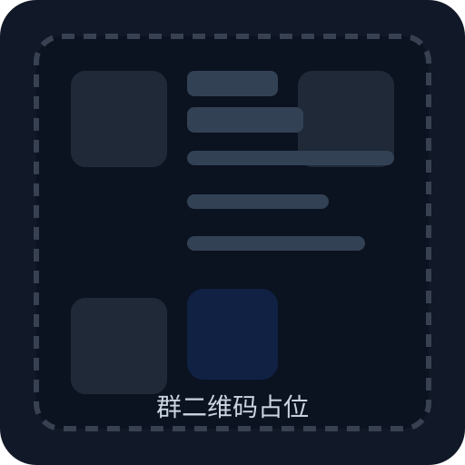

# Seedance 2.0 AIGC Dashboard

一个聚焦火山引擎 `Seedance 2.0` 与阿里云 `Wan 2.7 Video` 的视频生成控制台。

GitHub:
`https://github.com/lcnwys/seedance2.0-AIGC-DASHBOARD`

## 1. 项目介绍

### 我为什么做这个项目

我是阿里云、火山云方向的服务商，平时会接触很多想用最新视频生成能力做业务验证、内容生产和工作流搭建的客户。

但真实情况是，很多客户并不缺需求，缺的是技术团队、部署能力和一套能快速跑起来的后台。  
所以我做这个项目，最初并不是为了“做一个很炫的开源仓库”，而是为了让自己触达的、没有技术开发能力的客户，也能更快用上 `Seedance 2.0` 和 `Wan 2.7 Video`。

这一套我自己先在线下场景里跑过，整体效果和落地效率都还不错，所以把它整理成公开版，方便更多朋友直接部署、试用、二开，也方便同行、工作室、企业客户快速验证。

### 这个项目适合谁

- 想快速接入火山引擎与阿里云视频模型的团队
- 没有完整研发团队，但想先把视频生成业务跑起来的客户
- 想做演示版、企业试用版、渠道版、私有化原型的朋友
- 想在这个基础上继续加支付、邀请码、代理体系、企业功能的开发者

### 已接入能力

#### 火山引擎

- `doubao-seedance-2-0-260128`
- `doubao-seedance-2-0-fast-260128`

#### 阿里云

- `wan2.7-r2v`

### 项目特色

- 双厂商统一接入
  一套后台同时管理火山引擎与阿里云视频模型，方便做对比、切换和团队共用。

- 视频统一工作台
  视频生成、素材资产、任务列表、费用统计在同一个后台完成。

- 团队维度配置 API Key
  不依赖单一全局 Key，可以按团队配置火山 / 阿里云 API Key，更适合多人协作和商用场景。

- 同时兼容 TOS 与 OSS
  视频生成结果与上传素材可以统一转存到对象存储，方便沉淀自己的资产。

- 更适合没有技术团队的客户快速起步
  公开版保留了最核心、最能落地的部分，去掉了更重的生产流程，部署门槛更低。

- 适合作为商业化基础盘继续扩展
  后面无论你是加会员、付费、企业功能、私有模型、代理体系，都比较顺手。

### 开源版的定位

这个仓库不是一个“堆满所有能力的大而全平台”，而是一个更适合实际交付、部署和二开的双厂商视频生成基础盘。

你可以把它理解成：

- 一个可直接演示的后台
- 一个适合拿去私有化部署的雏形
- 一个方便继续包装成商业产品的底座

## 2. 部署流程

完整部署说明可查看 [DEPLOY.md](./DEPLOY.md)。  
这里把最常用的两种方式单独列出来：本地模式和云服务器模式。

### 本地部署

适合：

- 本地开发
- 模型调试
- 功能验证
- 给客户先演示一版

#### 第一步：安装依赖

```bash
npm install
```

#### 第二步：准备环境变量

复制 `.env.example` 为 `.env`，至少填写这些字段：

```bash
DATABASE_URL="file:./dev.db"
JWT_SECRET="replace-with-a-long-random-secret"
ENCRYPTION_KEY="replace-with-a-stable-secret-used-for-team-api-key-encryption"

APP_PUBLIC_BASE_URL="http://localhost:8080"
TASK_WEBHOOK_SECRET="replace-with-a-random-webhook-secret"

TOS_ACCESS_KEY_ID=""
TOS_ACCESS_KEY_SECRET=""
TOS_REGION=""
TOS_BUCKET=""
TOS_ENDPOINT=""
TOS_PUBLIC_BASE_URL=""

OSS_ACCESS_KEY_ID=""
OSS_ACCESS_KEY_SECRET=""
OSS_REGION=""
OSS_BUCKET=""
OSS_ENDPOINT=""
OSS_PUBLIC_BASE_URL=""

REMOTE_ASSET_MAX_BYTES="5368709120"

DEFAULT_SUPER_ADMIN_EMAIL="admin@example.com"
DEFAULT_SUPER_ADMIN_PASSWORD="replace-with-your-own-strong-password"
DEFAULT_SUPER_ADMIN_NAME="系统管理员"
```

说明：

- 如果你用火山存储，就填 `TOS_*`
- 如果你用阿里云存储，就填 `OSS_*`
- `REMOTE_ASSET_MAX_BYTES` 控制远端结果转存大小上限，默认 5 GiB
- 团队 API Key 建议登录后台后按团队配置，不建议直接写死在全局环境变量
- `JWT_SECRET`、`ENCRYPTION_KEY`、`TASK_WEBHOOK_SECRET` 生产环境必须自己生成
- `APP_PUBLIC_BASE_URL` 只适合本地开发时填 `http://localhost:8080`，上线后要改成你的公网域名，例如 `https://your-domain.com`

#### 第三步：初始化数据库

```bash
npx prisma generate
npx prisma migrate deploy
```

如果你后续要继续修改 Prisma schema 并提交到仓库，建议使用：

```bash
npx prisma migrate dev --name your_change_name
```

#### 第四步：启动项目

```bash
npm run dev
```

浏览器访问：

`http://localhost:8080`

### 云服务器部署

适合：

- 公网演示
- 客户试用
- 团队内部长期使用
- 私有化交付

推荐环境：

- Node.js 20
- PM2
- Nginx
- Linux 服务器

#### 第一步：拉代码

```bash
git clone https://github.com/lcnwys/seedance2.0-AIGC-DASHBOARD.git
cd seedance2.0-AIGC-DASHBOARD
```

#### 第二步：安装依赖并初始化

```bash
npm install
npx prisma generate
npx prisma migrate deploy
npm run build
```

#### 第三步：使用 PM2 启动

```bash
pm2 start npm --name seedance2-dashboard -- start
pm2 save
```

#### 第四步：配置 Nginx 反向代理

```nginx
server {
    listen 80;
    server_name your-domain.com;
    client_max_body_size 100M;

    location / {
        proxy_pass http://127.0.0.1:8080;
        proxy_http_version 1.1;
        proxy_set_header Upgrade $http_upgrade;
        proxy_set_header Connection 'upgrade';
        proxy_set_header Host $host;
        proxy_set_header X-Real-IP $remote_addr;
        proxy_set_header X-Forwarded-For $proxy_add_x_forwarded_for;
        proxy_set_header X-Forwarded-Proto $scheme;
        proxy_read_timeout 3000s;
    }
}
```

#### 第五步：首次登录后台

先在 `.env` 里明确填写：

- `DEFAULT_SUPER_ADMIN_EMAIL`
- `DEFAULT_SUPER_ADMIN_PASSWORD`

启动后用这组账号登录，然后：

1. 配置团队
2. 配置火山 / 阿里云 API Key
3. 选择对象存储方案
4. 测试视频生成、素材转存、任务同步是否正常

## 3. 联系我

### 为什么可以放心联系我

我做这个项目，不是单纯为了“挂个代理身份”，而是长期围绕阿里云、火山云相关能力做实际服务和交付。

如果你有这些需求，都可以直接来聊：

- 希望拿到更合适的折扣
- 希望了解代理政策
- 想谈项目返点
- 想做私有化部署
- 想做企业版、定制版、二开版
- 想找技术圈朋友交流项目和合作

我的合作原则会尽量做到：

- 政策讲清楚
- 折扣讲清楚
- 交付边界讲清楚
- 后续维护讲清楚

### 微信联系方式预留

下面这两个位置我先帮你预留好，后面你可以直接替换成自己的微信二维码和群二维码。

| 我的二维码 | 技术交流微信 |
| --- | --- |
|  |  |

说明：

- 左侧二维码位后面替换成你的个人微信二维码。
- 右侧先放群二维码占位，等你处理好再换成真实图片。
- 你把微信链接发我后，我可以继续帮你把左侧二维码生成成真正可扫码的版本。
- 如果你希望，我也可以继续帮你把首页和登录页的联系入口同步改成这套信息。
